# ThinkArt
## Bringing Imagination a Step Closer to Reality
### (Submission for Hacktrix Hackathon) 

ThinkArt is a flutter application based on selling of art/paintings in the digital market. In the current market , due to COVID 19, many artists have lost their jobs and also all public art galleries and public auction of paintings are closed. This is where ThinkArt comes in. This application has everything a customer wants when going to look for buying a painting in the market and also simultaneously giving buisness to the artists. This application is totally different from anything there is in the market right now with the most notable features being :- 

  -> Viewing of Art that customer wants to buy in their own 3D space (wall in house) with the help of Augmented Reality
  
  -> Creating Art from their imagination through passing of text with the help of AI in the app
  
  -> Attend public auctions of paintings and place a bid.
  
  -> Get a sketch drawn of their pictures by artists.
  
  -> Easy payment options through TAZ (A custom Blockchain based payment system which is deployed in MATIC Network)
  
 ## Features:
 
 ### Virtual Art Gallery 
 
 

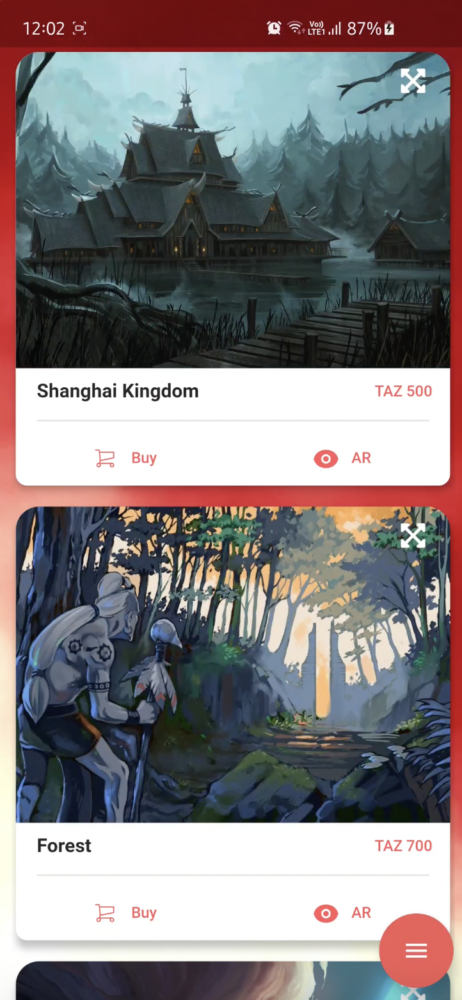
 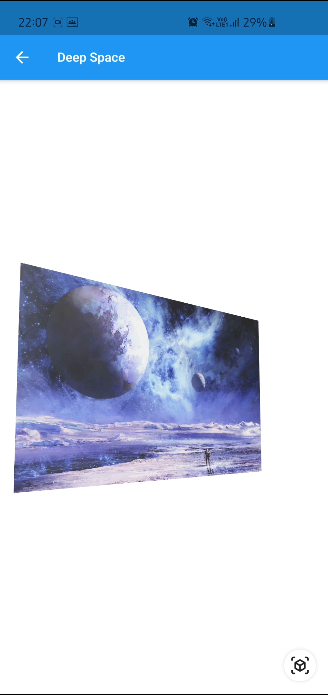
 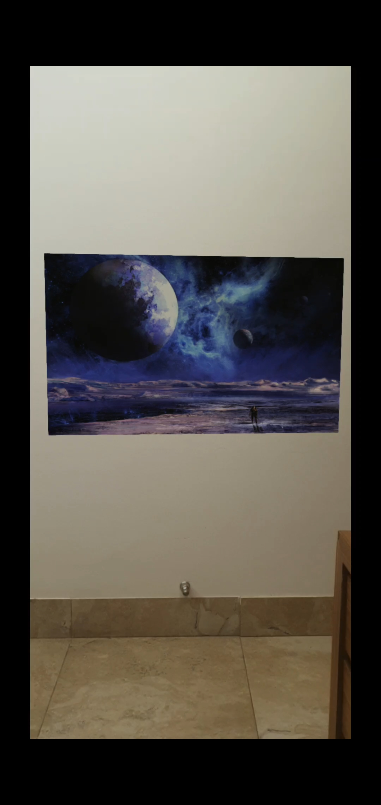

Normal traditional Art is displayed here. Customer can order 2 types of painting - sizeable (the size/dimensions of the painting can be set by the user) and fixed (not sizeable) paintings. All the Paintings can be viewed in Augmented Reality directly at the wall of your house where one can think of putting it after buying it and get a better understanding of the painting and how will it look in there house.

### Bid Palace

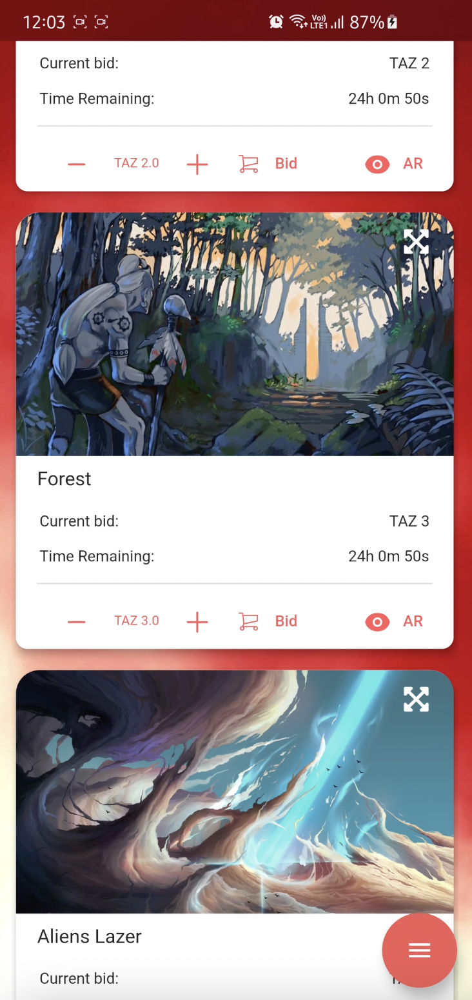
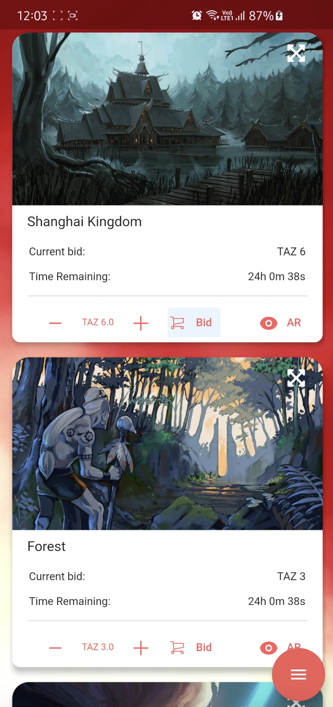

 
 Most of the famous paintings in today's world are sold in Auctions. So why not also have a digital auction of the artpieces inside the very app. One can 
 enter the auction if they bid the current highest using the TAZ coins (Blockchain based coin system inside the app) and after the timer ends the amount will be cut directly from the customer's TAZ Wallet and an order will be placed in the customer's name.
 
 ### ImagiArt
 
 

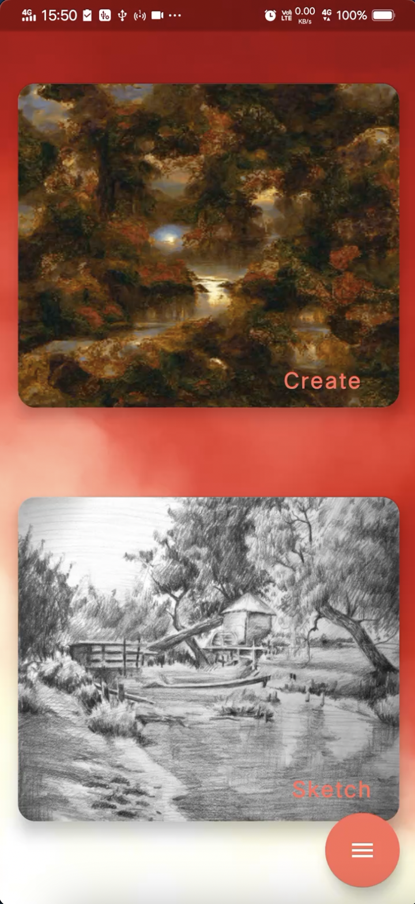
 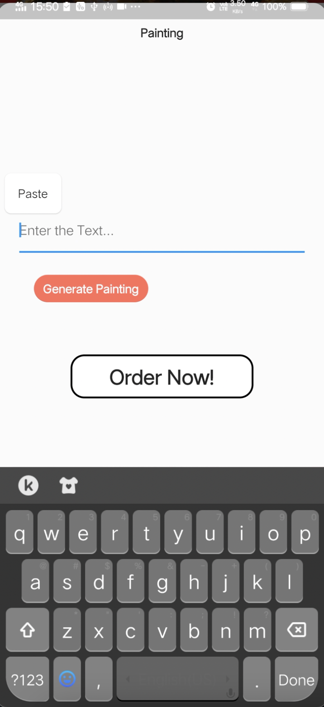
  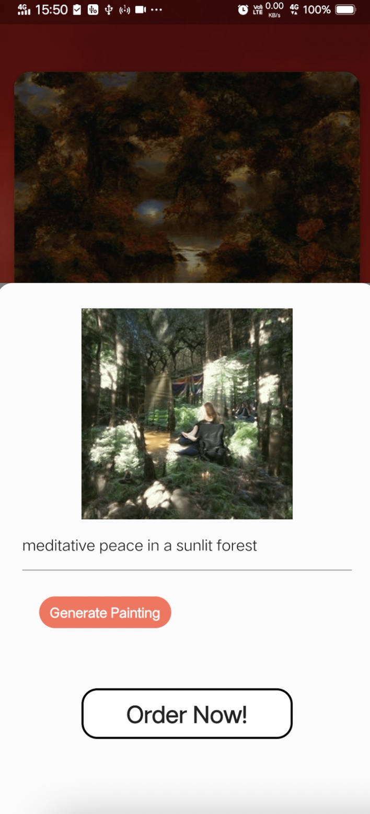

Most people in today's world buy paintings/art that are already drawn by artists irrespective of the customer's choice and likings. But what if the customer can choose exactly what they want. Yes, it can be done in ThinkArt. In ImagiArt, the customer can specify on what lines does he want a painting via text (for eg: night sky with moon , apple under a tree etc); and the Artificial Intelligence algorithm will generate a painting based on that text and the customer can order it. The painting order will be forwarded to the artists and therefore the customer can get exactly what they want.

### Skecz

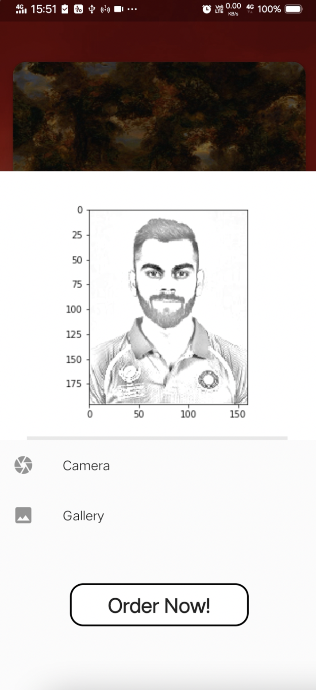

In the current market, finding a sketch artist to draw your potrait is impossible. But tension not, ThinkArt covers you. One has to just upload an image whose sketch he/she wants and within mere seconds a sketch will be generated by an AI algorithm and it can be directly ordered by the customers.

### BlockPay using TAZ Coins

 

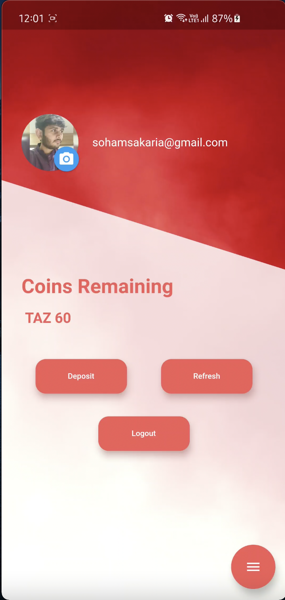
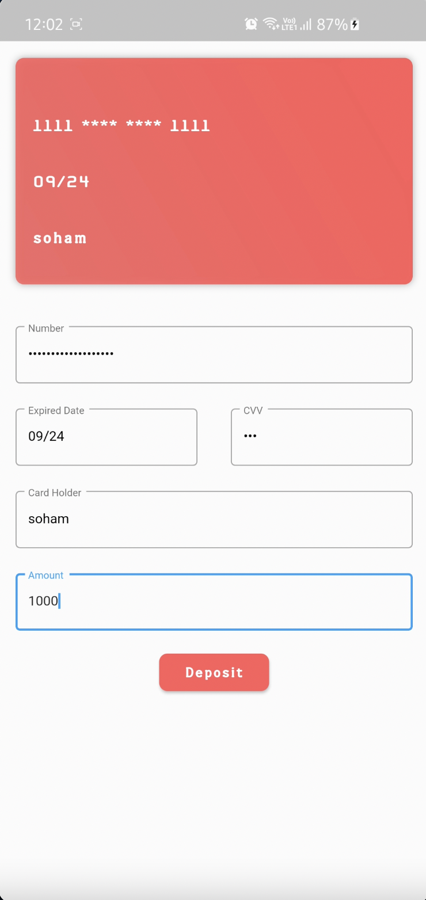
 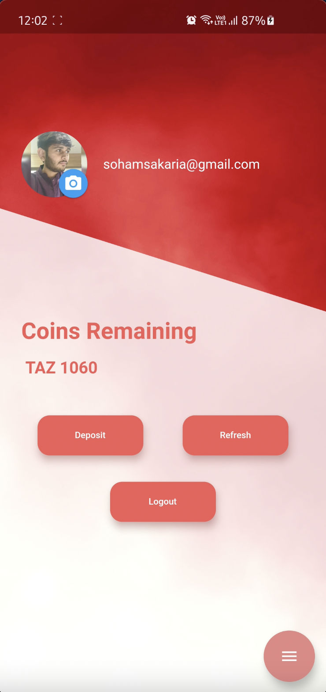

Secure Payment has been a worry among people all around the world. Hence, we have a currency system of our own 'TAZ' coins which is completely transparent and based on Blockchain Technology (smart contract deployed in Matic Network). One has to deposit money from their bank account into the coins and then they will can easily enter into auctions and also easily buy the paintings.

For buying

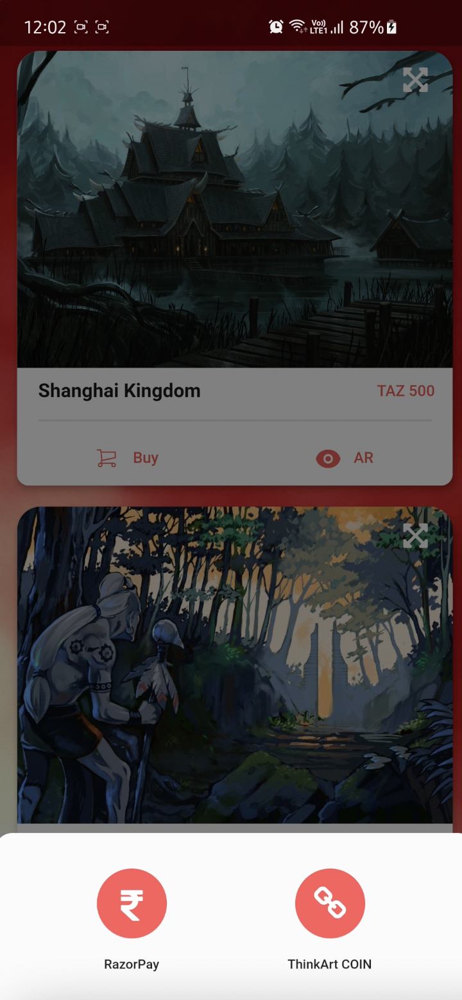
 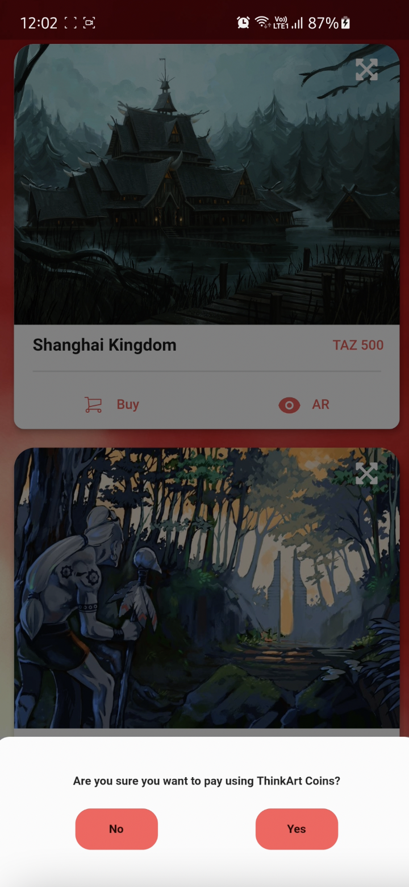
  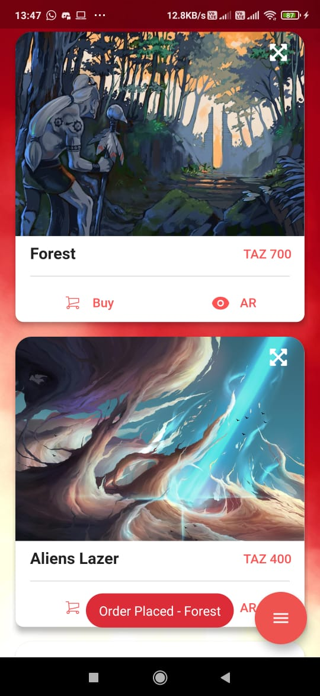

A simple blockchain payment using TAZ coins has been demonstrated above which happens in a matter of mere seconds.

Blockchain transactions happening Simultaneously in Matic :- 

 

The above images are proof that with every transaction, a new block is being created in the Blockchain network. The payment is completely transparent and the transfer of ownership of the painting can also be done using the Blockchain network.

### Payment using other methods 

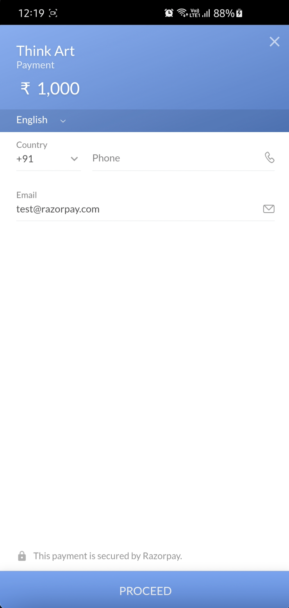

There are options open to people who do not want to put their money in TAZ coins. We have set a proper payment gateway for people who want to use UPI/Debit Card/Credit card etc etc.

### Other Images of the application :- 

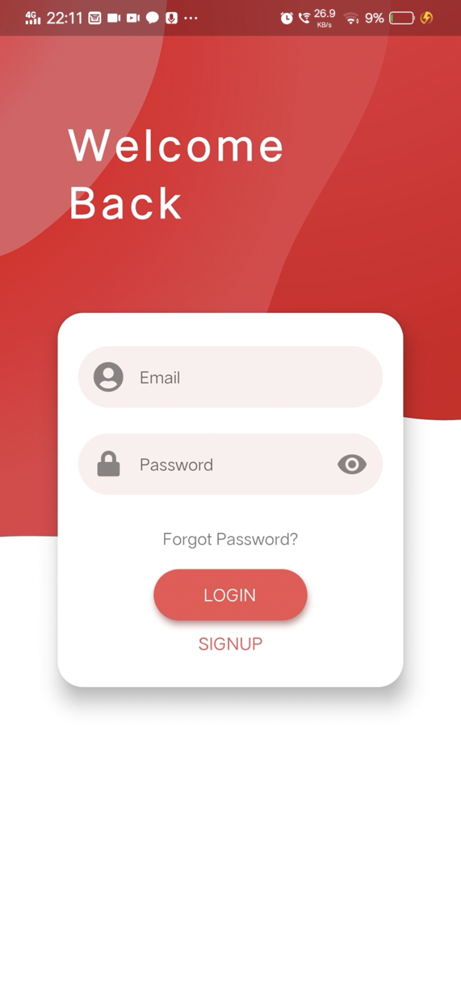
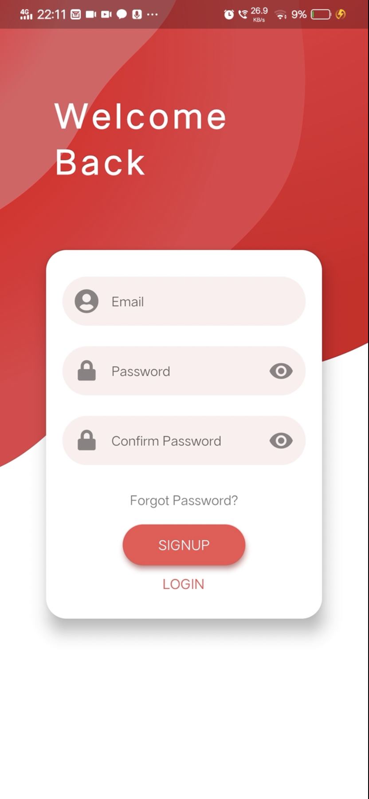
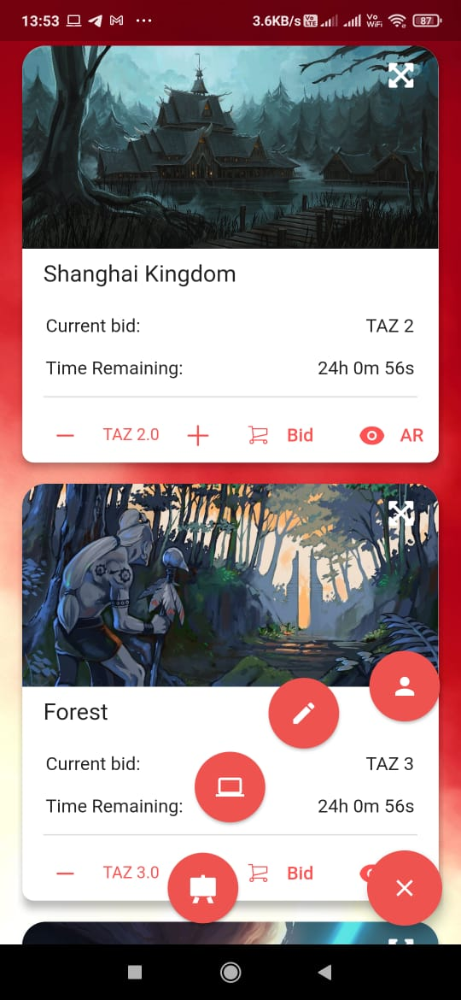

These are other images of the application showing the intuitive UI of the application.

## Conclusion
In the current market, there is no proper application around the monopoly of paintings. With ThinkArt, we are providing features that will cover A-Z of anyone who wants to buy/understand a painting and also employ/give work to artists/painters who are out of jobs because of closed Art galleries/public art auctions. This is a platform for artists/painters to showcase their work and also customers to enjoy the art and buy happiness in their house. We aim to provide a bridge between artists/painters and common people/customers and thereby uplifting this niche industry and bring happiness to everyone.

#### Thanking You,
#### Team Ctrl Alt Elite

## Developers

<table>
<tr align="center">
  
  <td>
  
Eeshan Dutta

</td>

<td>

Parth Srivastava 

</td>

<td>
  
 <td>

Soham Sakaria

</td>

<td>

<td>

Parth Pandey

</td>
</tr>

 </table>
